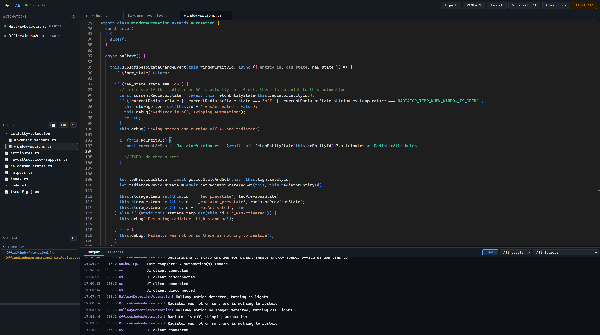

# TypeScript Automation Engine (TAE)

Write and run Home Assistant automations in TypeScript with a managed runtime, built-in code editor, and real-time logging.

## Features

- **TypeScript automations** - Write automations in TypeScript with full type safety and autocomplete
- **Worker thread isolation** - Automations run in a dedicated worker thread for clean reloads and fault isolation
- **Built-in editor** - Monaco-based editor with TypeScript IntelliSense, syntax highlighting, and multi-tab support
- **AI Friendly-ness** - Provides ai context files and since the language is typescipt, common AI assistants can make automations with ease
- **File management** - Create, rename, delete, and drag-drop files/folders directly in the UI
- **Lifecycle management** - Predictable automation lifecycle (`onStart` → `onStop` → `onReload` → `onUnload`)
- **HA integration** - Full WebSocket connection to Home Assistant for calling services, subscribing to events, and monitoring state changes
- **Persistent storage** - SQLite-backed key/value storage that survives restarts, plus in-memory temp storage
- **Real-time logging** - View logs in the UI with level and source filters; auto-scroll toggle to lock the view to the latest entry
- **Storage viewer** - Inspect persistent (SQLite) and temporary (in-memory) storage in real time from the sidebar
- **External sync** - Import/export automations to `/share/tae` for backup and version control



## Installation

[](https://my.home-assistant.io/redirect/supervisor_add_addon_repository/?repository_url=https%3A%2F%2Fgithub.com%2FCycov%2Fcycov-home-assistant)

1. In Home Assistant, go to **Settings → Add-ons → Add-on Store → ⋮ → Repositories**
2. Add the repository URL: `https://github.com/Cycov/cycov-home-assistant`
3. Find **TypeScript Automation Engine** in the store and click **Install**
4. Start the addon and open the **TAE** panel in your sidebar

## Quick Start

1. Open the TAE panel in your Home Assistant sidebar
2. Edit `automations/index.ts` in the built-in editor
3. Click **⟳ Reload** to apply changes

## Writing Automations

Every automation is a class that extends `Automation`:

```typescript
import { Automation, registerAutomation, startAutomation, LogLevel } from 'tae';

class MotionLightAutomation extends Automation {
  async onStart() {
    // Subscribe to a binary sensor state change
    this.subscribeToStateChangeEvent(
      'binary_sensor.hallway_motion',
      async (data) => {
        if (data.new_state?.state === 'on') {
          // Turn on a light
          await this.callService('light', 'turn_on', {
            entity_id: 'light.hallway',
            brightness: 200,
          });
          this.log('Hallway light turned on due to motion');
        } else if (data.new_state?.state === 'off') {
          await this.callService('light', 'turn_off', {
            entity_id: 'light.hallway',
          });
          this.log('Hallway light turned off');
        }
      }
    );

    this.log('Motion light automation started');
  }

  async onStop() {
    this.log('Motion light automation stopped');
  }
}

// Register and start in the onInit export
export function onInit() {
  const motionLight = new MotionLightAutomation();
  registerAutomation(motionLight);
  startAutomation(motionLight);
}
```

### Entry Point

Your `automations/index.ts` must export an `onInit()` function. This is called by the engine after loading the file. Register and start all your automations here:

```typescript
export function onInit() {
  // Create instances, register, and start
  const auto1 = new MyAutomation();
  registerAutomation(auto1);
  startAutomation(auto1);

  const auto2 = new AnotherAutomation('custom-id');
  registerAutomation(auto2);
  startAutomation(auto2);
}
```

### Organizing Automations

You can split automations into multiple files. Create files/folders in the built-in editor and import them:

```
automations/
  index.ts              ← entry point
  lights/
    motion-light.ts     ← automation class
    sunset-dimmer.ts
  climate/
    thermostat.ts
  utils/
    helpers.ts          ← shared utilities
```

```typescript
// automations/index.ts
import { registerAutomation, startAutomation } from 'tae';
import { MotionLightAutomation } from './lights/motion-light';
import { ThermostatAutomation } from './climate/thermostat';

export function onInit() {
  const motionLight = new MotionLightAutomation();
  registerAutomation(motionLight);
  startAutomation(motionLight);
  // ...
}
```

## Automation Lifecycle

| Hook         | When Called                                                | Use For                                    |
|--------------|-----------------------------------------------------------|--------------------------------------------|
| `onStart()`  | Automation enters running state                           | Setting up subscriptions, initial logic     |
| `onStop()`   | Automation is stopped (via UI, API, or error)             | Cleaning up timers and non-sub resources    |
| `onReload()` | Engine reloads (all automations restart)                  | Handling reload-specific logic              |
| `onUnload()` | Automation is permanently removed (before shutdown)       | Final cleanup                               |

**Important:** Event subscriptions are automatically cleaned up on stop - you do NOT need to manually unsubscribe in `onStop()`.

## API Reference

### Constructor

```typescript
class MyAutomation extends Automation {
  constructor() {
    // Auto-generated ID: "MyAutomation1", "MyAutomation2", ...
    super();

    // Or specify a custom ID:
    super('my-custom-id');
  }
}
```

### Calling Home Assistant Services

Invoke any HA service. This is equivalent to calling a service from Developer Tools → Services.

```typescript
const result = await this.callService(domain, service, data?)
```

| Parameter | Type     | Description                                                    |
|-----------|----------|----------------------------------------------------------------|
| `domain`  | `string` | The service domain - the part before the dot in HA service calls. This is the integration or platform name. Examples: `"light"`, `"switch"`, `"climate"`, `"notify"`, `"media_player"`, `"automation"`, `"scene"`, `"script"`, `"input_boolean"`, `"input_number"`, `"input_select"`, `"input_text"`, `"cover"`, `"fan"`, `"vacuum"`, `"lock"`, `"alarm_control_panel"`, `"camera"`, `"tts"`, `"number"`, `"select"`, `"button"` |
| `service` | `string` | The service action - the part after the dot. This tells HA what to do. Examples: `"turn_on"`, `"turn_off"`, `"toggle"`, `"set_temperature"`, `"send_message"`, `"set_hvac_mode"`, `"set_value"`, `"select_option"`, `"press"`, `"set_cover_position"`, `"set_speed"`, `"start"`, `"stop"`, `"set_volume_level"`, `"play_media"` |
| `data`    | `object` | Optional service data payload. Almost always includes `entity_id` to target specific entities. Other parameters are service-specific - check HA Developer Tools → Services for the available fields for each service. |
| **Returns** | `Promise<any>` | Resolves with the HA service response (usually `null` for fire-and-forget services). |

**Examples:**

```typescript
// Turn on a light with brightness and color temperature
await this.callService('light', 'turn_on', {
  entity_id: 'light.living_room',
  brightness: 200,
  color_temp: 350,
});

// Turn off multiple lights
await this.callService('light', 'turn_off', {
  entity_id: ['light.kitchen', 'light.hallway'],
});

// Send a mobile notification
await this.callService('notify', 'mobile_app_your_phone', {
  message: 'Motion detected in the garage!',
  title: 'Security Alert',
  data: { priority: 'high' },
});

// Set thermostat temperature
await this.callService('climate', 'set_temperature', {
  entity_id: 'climate.living_room',
  temperature: 22,
  hvac_mode: 'heat',
});

// Run a script
await this.callService('script', 'turn_on', {
  entity_id: 'script.goodnight_routine',
});

// Toggle a switch
await this.callService('switch', 'toggle', {
  entity_id: 'switch.garage_door',
});
```

### Subscribing to Events

Listen for native Home Assistant events. This is a low-level API - for state changes, prefer `subscribeToStateChangeEvent` instead.

```typescript
// Subscribe to a specific HA event type
const unsub = this.subscribeToEvent(eventType, callback);
```

| Parameter   | Type       | Description                                                    |
|-------------|------------|----------------------------------------------------------------|
| `eventType` | `string`   | HA event type to listen for. Common types: `"state_changed"` (any entity state update), `"call_service"` (any service call), `"zha_event"` (Zigbee Home Automation device events), `"deconz_event"` (deCONZ device events), `"timer.finished"` (timer expired), `"automation_triggered"` (native HA automation triggered), `"script_started"`, `"homeassistant_start"`, `"homeassistant_stop"`. Find event types in HA Developer Tools → Events. |
| `callback`  | `function` | Called each time the event fires. Receives the full HA event object with properties: `event_type` (string), `data` (event-specific payload object), `origin` ("LOCAL" or "REMOTE"), `time_fired` (ISO timestamp), `context` ({ id, parent_id, user_id }). |
| **Returns** | `() => void` | An unsubscribe function. Call it to stop listening before automation stop. Not required - all subscriptions are auto-cleaned on stop. |

```typescript
// Listen for ZHA (Zigbee) remote button events
this.subscribeToEvent('zha_event', (event) => {
  if (event.data.device_ieee === '00:11:22:33:44:55:66:77') {
    if (event.data.command === 'toggle') {
      this.callService('light', 'toggle', { entity_id: 'light.bedroom' });
    }
  }
});

// Listen for timer events
this.subscribeToEvent('timer.finished', (event) => {
  this.log('Timer finished!', event.data);
});
```

### Subscribing to State Changes

The most common way to react to entity changes. Fires whenever a specific entity (or any entity) changes state.

```typescript
// Watch a specific entity
const unsub = this.subscribeToStateChangeEvent(entityId, callback);

// Watch ALL entity state changes (use sparingly - fires frequently)
const unsub = this.onStateChange(callback);
```

| Parameter  | Type       | Description                                                    |
|------------|------------|----------------------------------------------------------------|
| `entityId` | `string`   | The full entity ID to watch. This is the entity's unique identifier in HA (e.g., `"binary_sensor.front_door"`, `"sensor.living_room_temperature"`, `"light.bedroom"`, `"switch.coffee_maker"`, `"person.john"`). Find entity IDs in HA → Settings → Devices & Services → Entities. |
| `callback` | `function` | Called with a `StateChangeData` object containing: `entity_id` (string - the entity that changed), `old_state` (previous `HAEntityState \| null` - null if entity was just created), `new_state` (new `HAEntityState \| null` - null if entity was removed). Each state object has: `.state` (string value like `"on"`, `"off"`, `"22.5"`, `"home"`), `.attributes` (object with device-specific data), `.last_changed` (ISO timestamp when state value changed), `.last_updated` (ISO timestamp when any attribute changed). |
| **Returns** | `() => void` | Unsubscribe function. Optional - auto-cleaned on stop. |

```typescript
// Monitor a door sensor
this.subscribeToStateChangeEvent('binary_sensor.front_door', async (data) => {
  if (data.new_state?.state === 'on') {
    this.log('Front door opened!');
    // data.old_state?.state  = previous state
    // data.new_state.attributes = current attributes
  }
});

// Monitor all temperature sensors
this.onStateChange((data) => {
  if (data.entity_id.startsWith('sensor.') && data.entity_id.includes('temperature')) {
    const temp = parseFloat(data.new_state?.state || '0');
    if (temp > 30) {
      this.warn(`High temperature: ${data.entity_id} = ${temp}°C`);
    }
  }
});
```

### Getting Entity State

Read the current state of any entity without subscribing to changes.

```typescript
// From cache (fast, no network call - may be a few seconds stale)
const state = await this.getEntityState('sensor.temperature');

// Live from HA (network call to HA API - always fresh but slower)
const state = await this.fetchEntityState('sensor.temperature');
```

| Method | Parameter | Returns | Description |
|--------|-----------|---------|-------------|
| `getEntityState` | `entityId: string` | `Promise<HAEntityState \| undefined>` | Reads from the in-memory state cache (populated on connect, updated via subscription). Instant, no network call. Returns `undefined` if entity not found. |
| `fetchEntityState` | `entityId: string` | `Promise<HAEntityState \| undefined>` | Makes a live API call to Home Assistant. Use when you need guaranteed fresh data, e.g., before making a decision based on current state. |

The returned state object:

```typescript
{
  entity_id: 'sensor.temperature',
  state: '22.5',                          // Always a string
  attributes: {
    unit_of_measurement: '°C',
    friendly_name: 'Living Room Temperature',
    device_class: 'temperature',
    // ... other entity-specific attributes
  },
  last_changed: '2024-01-15T10:30:00.000Z',
  last_updated: '2024-01-15T10:30:00.000Z',
  context: { id: '...', parent_id: null, user_id: null },
}
```

### Logging

All log methods accept any type for the message (string, object, number, etc.). Objects are automatically pretty-printed in both the console and UI.

The `log_level` addon config only filters **console** output. All log levels are always sent to and visible in the UI (use the UI dropdown to filter there).

```typescript
// Standard level methods
this.log('Something happened');           // INFO level
this.warn('Watch out!');                  // WARN level
this.error('Something broke!');           // ERROR level
this.debug('Detailed info');              // DEBUG level

// Log with a specific level override (second param is LogLevel)
this.log('Verbose detail', LogLevel.Debug);     // Uses DEBUG level
this.log('Critical issue', LogLevel.Error);     // Uses ERROR level

// Log objects - automatically pretty-printed in console and UI
this.log({ entities: ['light.a', 'light.b'], brightness: 200 });

// Log with extra data attached (rendered as expandable block in UI)
this.log('Service called', { domain: 'light', service: 'turn_on' });
```

| Method | Signature | Description |
|--------|-----------|-------------|
| `this.log()` | `(message: any, levelOrExtra?: LogLevel \| any)` | Logs at INFO level by default. Pass a `LogLevel` value as second arg to override the level, or pass any other value to attach it as extra data. |
| `this.warn()` | `(message: any, extra?: any)` | Logs at WARN level. |
| `this.error()` | `(message: any, extra?: any)` | Logs at ERROR level. |
| `this.debug()` | `(message: any, extra?: any)` | Logs at DEBUG level. |

**LogLevel enum values:** `LogLevel.Debug`, `LogLevel.Info`, `LogLevel.Warn`, `LogLevel.Error`

Import LogLevel:

```typescript
import { LogLevel } from 'tae';
```

### Storage

Each automation gets its own namespaced key-value storage. Keys from different automations never collide - the namespace is the automation's ID.

| Storage Type | Backed By | Survives Restart | Use For |
|-------------|-----------|------------------|---------|
| `this.storage.persistent` | SQLite (WAL mode) | ✅ Yes | Timestamps, counters, user preferences, state that must survive restarts |
| `this.storage.temp` | In-memory Map | ❌ No | Caches, debounce flags, temporary counters, rate limiting |

All storage methods are async and return Promises.

```typescript
// Persistent storage (SQLite-backed, survives restarts)
await this.storage.persistent.set('lastMotionTime', Date.now());
const lastMotion = await this.storage.persistent.get('lastMotionTime');  // returns the value or undefined
await this.storage.persistent.delete('lastMotionTime');

// Temporary storage (in-memory, cleared on restart)
await this.storage.temp.set('counter', 0);
const counter = await this.storage.temp.get('counter');
await this.storage.temp.delete('counter');
```

Values are JSON-serialized, so you can store strings, numbers, booleans, arrays, and plain objects.

### Standalone Functions

These functions provide the same capabilities as instance methods but can be used outside of an automation class - e.g., in `onInit()` or utility modules.

```typescript
import {
  registerAutomation,  // Register automation with the engine (must call before start)
  startAutomation,     // Start a registered automation (calls onStart)
  stopAutomation,      // Stop a running automation (calls onStop)
  callService,         // Call HA service: callService(automation, domain, service, data?)
  subscribeToEvent,    // Subscribe: subscribeToEvent(automation, eventType, callback)
  subscribeToStateChangeEvent,  // State sub: subscribeToStateChangeEvent(automation, entityId, callback)
  onStateChange,       // All states: onStateChange(automation, callback)
  log, warn, error, debug,  // Standalone logging (source shown as "user")
  LogLevel,            // Enum: LogLevel.Debug, LogLevel.Info, LogLevel.Warn, LogLevel.Error
} from 'tae';
```

The HA API functions require passing the automation instance as the first argument:

```typescript
const myAuto = new MyAutomation();
registerAutomation(myAuto);
startAutomation(myAuto);

// Explicit API style
await callService(myAuto, 'light', 'turn_on', { entity_id: 'light.x' });
const unsub = subscribeToEvent(myAuto, 'zha_event', (e) => { /* ... */ });

// Standalone logging (not tied to any automation)
log('Application started');
debug('Init details', { automationsLoaded: 3 });
```

## Automation Identity

```typescript
// Auto-generated ID (ClassName + incrementing counter)
new MotionLightAutomation()     // → id: "MotionLightAutomation1"
new MotionLightAutomation()     // → id: "MotionLightAutomation2"

// Explicit ID (useful for storage namespace consistency)
new MotionLightAutomation('my-motion-light')  // → id: "my-motion-light"
```

## Built-in Editor (UI)

The addon provides a full-featured IDE accessible from the Home Assistant sidebar panel.

### Layout

The UI is divided into four areas:

1. **Header bar** (top) - Shows connection status, and buttons for Export, Import, Clear Logs, Work with AI, and Reload.
2. **Sidebar** (left) - Two sections:
   - **Automations** - Lists all registered automations with their state (running/stopped/error). Hover to reveal Start/Stop buttons.
   - **Files** - File tree with buttons to create files (+📄), create folders (+📁), and refresh (↻).
3. **Editor** (center) - Monaco-based TypeScript editor with tabs. Supports:
   - Full TypeScript IntelliSense with TAE API autocomplete
   - Multi-tab editing (click files in tree to open)
   - `Ctrl+S` / `Cmd+S` to save the current file
   - Unsaved changes warning when closing tabs
   - Syntax highlighting, auto-formatting, word wrap
4. **Bottom panel** - Two tabs:
   - **Output** - Real-time log output with level and source filters, color-coded levels, and auto-scroll
   - **Terminal** - Interactive console for calling TAE functions with smart autocomplete

### File Tree Operations

| Action                  | How                                                      |
|-------------------------|----------------------------------------------------------|
| Create file             | Click `+📄` button in the Files header                   |
| Create folder           | Click `+📁` button in the Files header                   |
| Open a file             | Single-click the file in the tree                        |
| Rename file/folder      | Double-click the name to edit inline, press Enter to save |
| Delete file/folder      | Click the ✕ button that appears on hover                 |
| Delete via keyboard     | Click a file (selecting it), then press `Delete` key     |
| Move file to folder     | Drag and drop the file onto a folder                     |
| Expand/collapse folder  | Single-click the folder row                              |
| Refresh file tree       | Click the ↻ button in the Files header                   |

### Toolbar Actions

| Button          | Description                                                    |
|-----------------|----------------------------------------------------------------|
| **Export**      | Copies all automation files to the sync path (`/share/tae`)    |
| **Import**      | Overwrites automations from the sync path (with confirmation)  |
| **Clear Logs**  | Clears the log panel and log buffer                            |
| **Work with AI**| Opens a dialog to download entities list and SKILL.md for AI assistants |
| **⟳ Reload**    | Auto-saves all modified files, then stops the worker, re-compiles and re-loads all automations. Shows an orange badge with the count of unsaved files. |

### Automation Controls

Each automation in the sidebar shows:
- A colored dot: 🟢 running, ⚪ stopped, 🔴 error
- The automation ID
- On hover: **Start** or **Stop** button

Click Start/Stop to control individual automations without a full reload.

### File Saving Behavior

- **`Ctrl+S` / `Cmd+S`** saves the currently active file immediately.
- **Unsaved tabs** show an orange dot (●) next to the filename.
- **Closing a modified tab** shows a dialog with three options: Save & Close, Discard, or Cancel.
- **Reload button** displays an orange badge with the count of unsaved files. Clicking Reload auto-saves all modified files before restarting the worker.
- **Navigating away** with unsaved changes shows a browser confirmation dialog.

### Storage Viewer

The sidebar includes a **Storage** section that shows all persistent and temporary key/value data in real time (polled every 3 seconds). Entries are grouped by namespace with collapsible sections. Click a namespace header to expand or collapse its entries.

### Output Auto-Scroll

The log panel includes an auto-scroll toggle button (**⤓**) in the filter bar. When active (highlighted), the log view automatically scrolls to the latest entry. Scrolling up manually disables auto-scroll; click the button again to re-enable it.

### Resizable Sidebar Panels

The three sidebar sections (Automations, Files, Storage) are separated by drag handles. Drag a handle up or down to resize the adjacent panels.

### Terminal

The Terminal tab in the bottom panel provides an interactive console for calling TAE functions directly against your Home Assistant instance. Switch to it by clicking the **Terminal** tab next to **Output**.

#### Available Commands

| Command | Description |
|---------|-------------|
| `callService(domain, service, data?)` | Call any Home Assistant service |
| `getEntityState(entityId)` | Read entity state from the in-memory cache |
| `fetchEntityState(entityId)` | Fetch fresh entity state from the HA API |
| `getAllEntities()` | List all entities with their current state |
| `help` | Show all available commands |
| `help <command>` | Show detailed help with examples for a specific command |

#### Usage Examples

```
callService('light', 'turn_on', {entity_id: 'light.bedroom', brightness: 200})
callService('switch', 'toggle', {entity_id: 'switch.fan'})
callService('climate', 'set_temperature', {entity_id: 'climate.living_room', temperature: 22})
getEntityState('sensor.living_room_temperature')
fetchEntityState('binary_sensor.front_door')
getAllEntities()
help callService
```

#### Autocomplete

The terminal provides context-aware autocomplete as you type:

- **Function names** - Suggested at the start of input. Press `Tab` to show all functions.
- **Service domains** - When typing the first argument of `callService`, suggests domains (`light`, `switch`, `climate`, etc.).
- **Service actions** - When typing the second argument, suggests services filtered by the chosen domain (e.g., `turn_on`, `turn_off` for `light`).
- **Entity IDs** - Autocomplete for entity IDs when typing inside `getEntityState()`, `fetchEntityState()`, or within the `entity_id` field of a `callService` data object. Entities are filtered by domain when applicable.
- **Help topics** - When typing after `help`, suggests available function names.

Navigate autocomplete with:
- `Tab` - Open autocomplete or accept the selected suggestion
- `Arrow Up` / `Arrow Down` - Navigate through suggestions
- `Enter` - Accept the selected suggestion
- `Escape` - Close the autocomplete popup

#### Command History

Press `Arrow Up` / `Arrow Down` when autocomplete is closed to navigate through previously executed commands.

### Work with AI

Click the **Work with AI** button in the toolbar to open a dialog for downloading context files to use with AI assistants (e.g., GitHub Copilot, ChatGPT):

- **Download Entities (.txt)** - Downloads a categorized list of all your Home Assistant entities grouped by domain, including friendly names, states, device classes, and units.
- **Download SKILL.md** - Downloads the TAE skill/instruction file that provides AI assistants with context about the TAE API, your project structure, and how to write automations.

## Configuration

| Option     | Default      | Description                                      |
|------------|--------------|--------------------------------------------------|
| `log_level`| `info`       | Minimum log level for **console output**: `debug`, `info`, `warn`, `error`. Note: all log levels are always visible in the UI regardless of this setting - the UI has its own level filter. |
| `sync_path`| `/share/tae` | External directory for import/export sync        |

## Architecture

```
┌─────────────────────────────────────────────────┐
│  Main Process                                   │
│  ┌────────────┐ ┌──────────┐ ┌──────────────┐  │
│  │ Express +   │ │ HA WS    │ │ Storage      │  │
│  │ WebSocket   │ │ Client   │ │ (SQLite)     │  │
│  │ Server      │ │          │ │              │  │
│  └──────┬──────┘ └────┬─────┘ └──────┬───────┘  │
│         │             │              │           │
│  ┌──────┴─────────────┴──────────────┴───────┐  │
│  │ Worker Manager                            │  │
│  │ (routes messages between worker and HA)   │  │
│  └──────────────────┬────────────────────────┘  │
└─────────────────────┼───────────────────────────┘
                      │ Worker Thread
┌─────────────────────┼───────────────────────────┐
│  ┌──────────────────┴────────────────────────┐  │
│  │ Bridge (MessagePort communication)        │  │
│  └──────────────────┬────────────────────────┘  │
│  ┌──────────────────┴────────────────────────┐  │
│  │ Automation Manager                        │  │
│  │ (lifecycle, subscriptions, error handling)│  │
│  └──────────────────┬────────────────────────┘  │
│  ┌──────────────────┴────────────────────────┐  │
│  │ Your Automations (index.ts)               │  │
│  │ ts-node runtime compilation               │  │
│  └───────────────────────────────────────────┘  │
└─────────────────────────────────────────────────┘
```

- **Main Process**: Runs Express HTTP/WS server, connects to HA via WebSocket, manages SQLite storage.
- **Worker Thread**: Isolated thread that compiles and runs your TypeScript automations via ts-node. If an automation crashes, only the worker is affected.
- **Bridge**: MessagePort-based communication between main and worker. All HA API calls, storage operations, and event forwarding pass through the bridge.

## Security

- **Child process blocking**: `child_process` module is blocked in automations for security.
- **Path traversal protection**: All file operations are sandboxed to the automations directory.
- **Supervisor token**: Authentication via HA supervisor token - never exposed to automations.

## Troubleshooting

| Issue | Solution |
|-------|---------|
| "TAE runtime not initialized" | Your automation file must be loaded by the engine, not run directly with `node`. |
| "Automation not running" error | Make sure to call `startAutomation()` after `registerAutomation()`. |
| No autocomplete in editor | Wait for the editor to load type definitions. Try reloading the page. |
| Changes not taking effect | Click **⟳ Reload** in the toolbar to restart the worker with new code. |
| Log not showing debug messages | The `log_level` addon config controls **console** output only. All messages are shown in the UI. If you still don't see logs, check the UI level filter dropdown. |
| Terminal command returns string error | Make sure to quote string arguments: `callService('light', 'turn_on', {entity_id: 'light.x'})` |

## Changelog

### 1.6.0

- **Feature**: Storage viewer in the sidebar - real-time view of persistent and temporary storage grouped by namespace
- **Feature**: Resizable sidebar panels (Automations, Files, Storage) with drag handles
- **Feature**: Auto-scroll toggle in the output panel
- **Feature**: Browser confirmation dialog when navigating away with unsaved changes
- **Fix**: Terminal `help` autocomplete no longer appends `(`
- **UI**: Terminal placeholder changed to "Type 'help' for help"

### 1.5.0

- **Fix**: Terminal `callService` now correctly parses object arguments with string values (e.g., `{entity_id: 'light.x', brightness: 128}`)
- **Fix**: Terminal `callService` now sends `entity_id` via the HA `target` field for proper service targeting
- **Feature**: `help` command in terminal - `help` shows all commands, `help <command>` shows detailed help with examples
- **Feature**: Autocomplete for `help <command>` suggests available function names
- **Docs**: Added terminal usage documentation to README
- **Docs**: Added file saving behavior, Work with AI, and changelog sections to README

### 1.4.0

- **Fix**: SKILL.md download now works (file is copied into Docker image; server uses fallback paths)
- **Feature**: Terminal tab in bottom panel - interactive console for calling TAE functions (`callService`, `getEntityState`, `fetchEntityState`, `getAllEntities`)
- **Feature**: Context-aware autocomplete in terminal for domains, services (grouped by domain), entity IDs, and function names
- **Feature**: Reload button shows orange badge with unsaved file count
- **Feature**: Auto-save all modified files before reload
- **Feature**: Unsaved changes dialog when closing a modified tab (Save & Close / Discard / Cancel)
- **Feature**: Work with AI button - download entities list and SKILL.md for AI assistants

### 1.3.0

- **Feature**: Work with AI dialog with entities download and SKILL.md download
- **Fix**: `getEntityState` and `fetchEntityState` standalone exports
- **Feature**: YAML to TypeScript interface converter tool
